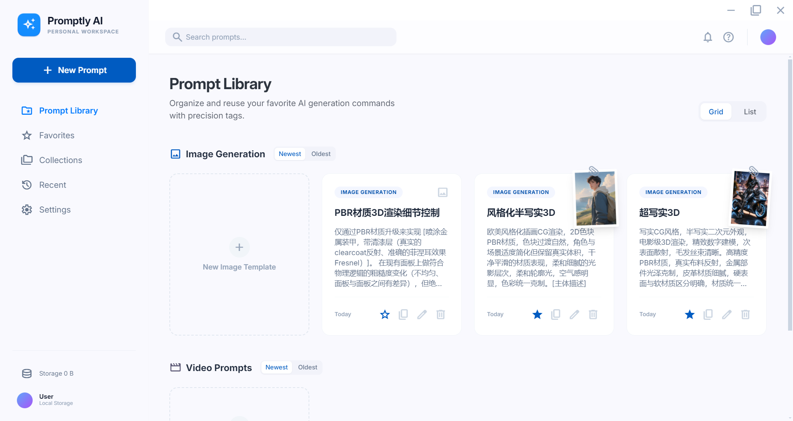
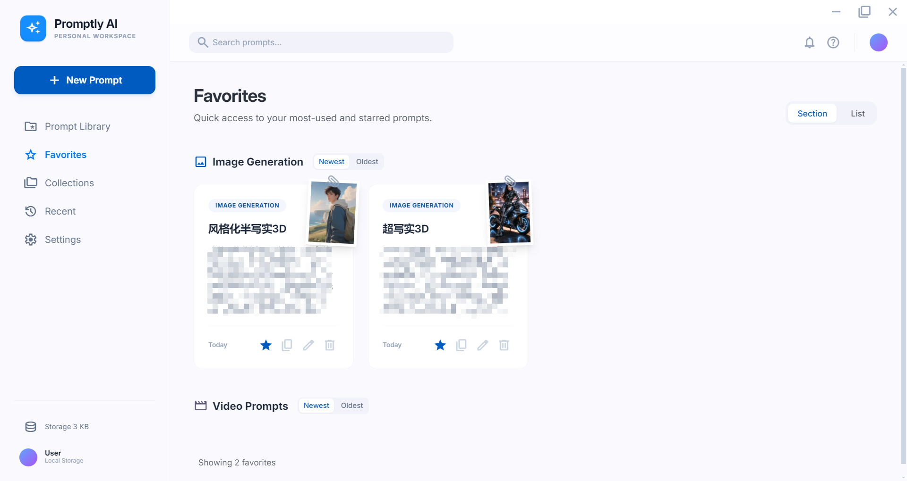
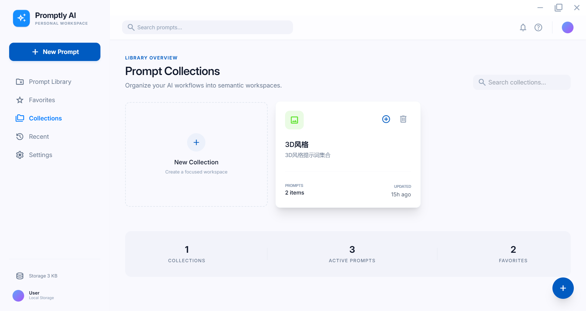
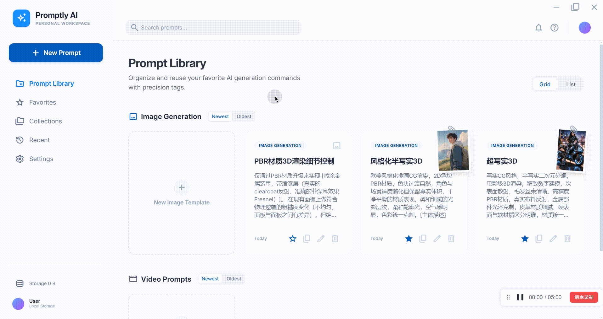
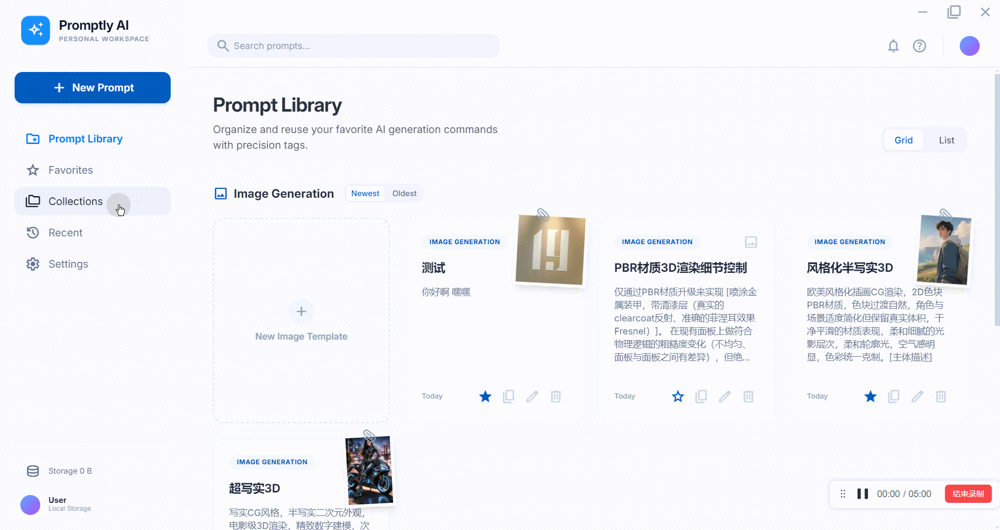

# Promptly AI

A modern AI prompt management tool built with Vue 3, Electron, and TypeScript.

## Features

- **Prompt Library** - Organize and manage your AI prompts with grid/list view toggle
- **Favorites** - Quick access to your most-used and starred prompts
- **Collections** - Group prompts into semantic workspaces for better organization
- **Recent** - Track your recently accessed prompts
- **Multi-language Support** - Store prompts in both Chinese and English

## Tech Stack

- **Frontend**: Vue 3 + TypeScript + Tailwind CSS
- **Desktop**: Electron
- **State Management**: Pinia
- **Routing**: Vue Router
- **Database**: SQLite (sql.js)
- **Icons**: Material Symbols Outlined

## Screenshots

### Prompt Library


### Favorites


### Collection


### ImageView


## GIF

### Creat new prompt


### View prompt detail


### Collection operation


## Getting Started

### Prerequisites

- Node.js >= 16
- npm >= 8

### Installation

```bash
# Clone the repository
git clone https://github.com/OYYH-Apple/Promptly-AI.git
cd Promptly-AI

# Install dependencies
npm install

# Start development server
npm run dev

# Build for production
npm run build
```

## Project Structure

```
src/
├── main/                 # Electron main process
├── preload/              # Electron preload scripts
└── renderer/
    └── src/
        ├── components/   # Reusable Vue components
        │   ├── ConfirmDialog.vue
        ├── ImageViewer.vue
        │   ├── Sidebar.vue
        │   ├── Toast.vue
        │   └── TopBar.vue
        ├── views/        # Page components
        │   ├── Library.vue
        │   ├── Favorites.vue
        │   ├── Collections.vue
        │   ├── CollectionDetail.vue
        │   ├── Recent.vue
        │   ├── Settings.vue
        │   ├── PromptDetail.vue
        │   └── CreatePrompt.vue
        ├── stores/       # Pinia state management
        ├── router/       # Vue Router configuration
        └── styles/       # Global styles
```

## Features Detail

### Global Components

- **ConfirmDialog** - Modal confirmation dialog with multiple types (warning, danger, info, success)
- **Toast** - Notification messages for user feedback
- **ImageViewer** - Full-screen image viewer with zoom and navigation

### Library View

- Grid and list view toggle
- Thumbnail previews with zoom cursor
- Click thumbnail to open image viewer
- Copy prompt to clipboard with toast notification
- Toggle favorite status

### Collections

- Create and manage collections with custom icons and colors
- Add prompts to collections via modal dialog
- View collection details with all prompts
- Remove prompts from collections

## Development

```bash
# Run in development mode
npm run dev

# Type check
vue-tsc --noEmit

# Build electron app
npm run electron:build
```

## License

Apache-2.0

## Changelog

### v1.1.1

#### 🐛 Bug Fixes
- 修复略缩图查看图片退出后的索引未重置问题
- 修复新建界面标签输入框标签历史显示问题

#### ✨ UI Improvements
- 优化固定菜单栏图标样式显示
- 列表展示增加图片略缩图，同时可点击查看预览
- 优化略缩图 UI
- 优化新建界面和编辑界面图片操作按钮 UI 布局

#### 🚀 Features
- 新增支持新建界面和编辑界面对图片拖拽排序功能
- 新增支持左侧菜单栏宽度调整收缩功能
- 新增支持侧边实时查看存储数据大小
- 编辑和新建提示词界面图片上传功能增强
- 新增用户反馈窗口
- 新增提示词网络可见性（为后期上线在线分享功能做准备）

## Author

codename19
